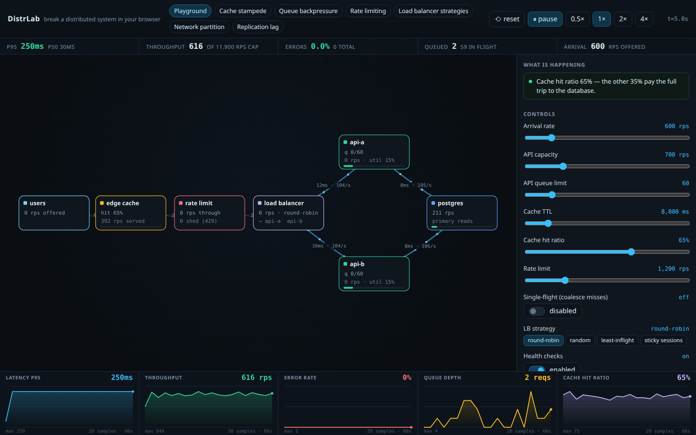
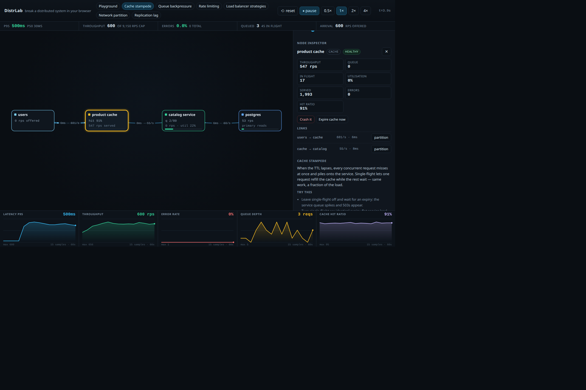
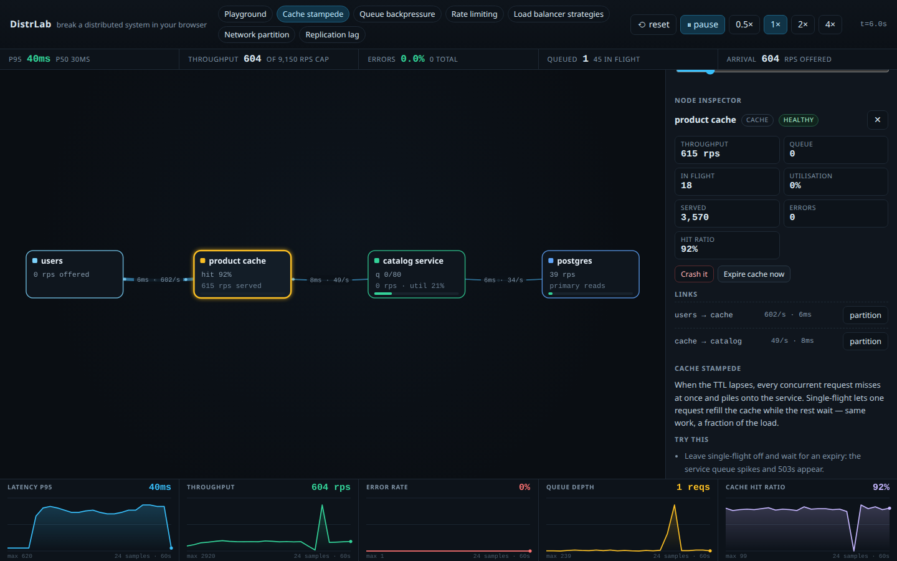

# DistrLab — distributed systems playground

Break a live service architecture in your browser, then watch it recover.

DistrLab simulates a small distributed system in real time: requests travel over
links, fill queues, hit caches, get load-balanced, throttled, partitioned and
timed out. You flip switches (single-flight, health checks, load-balancing
strategy, queue limits, …) and watch latency, throughput, errors and queue depth
react — then read the plain-language explanation of *why*.








**Free-tier by design.** No backend, no LLM, no paid API, no tracking. Everything
runs inside a Web Worker on a static page — works offline, deployable to any
static host (Cloudflare Pages, GitHub Pages, Netlify…).

## Scenarios

| # | Scenario | The lesson |
|---|----------|-----------|
| 1 | Playground | A healthy baseline: p95, throughput, capacity, queues, cache hit ratio |
| 2 | Cache stampede | Turning off single-flight near a TTL expiry herds every request at the origin |
| 3 | Queue backpressure | Shallow queues shed fast; deep queues trade errors for latency (both hurt) |
| 4 | Rate limiting | A token bucket in front of the service protects it, at the cost of 429s |
| 5 | Load balancer strategies | Round-robin vs random vs least-inflight vs sticky under skew and failure |
| 6 | Network partition | A cut link stops traffic; health checks + least-inflight route around it |
| 7 | Replication lag | Reading a replica is fast and stale; tune the lag and watch stale reads |

## Controls

- **Buttons in the header** switch scenarios, reset, pause, and set sim speed (space / `R` / `1`–`7` keyboard shortcuts).
- **The graph** is the live topology — click a node to open the Inspector, drag to rearrange, scroll to zoom, drag the background to pan.
- **Knobs** in the sidebar change arrival rate, capacities, queue limits, TTL, single-flight, LB strategy, health checks, timeouts, replica lag, and fault windows.
- **Inspector** can crash / restart a service, expire a cache, slow an instance, and partition/repair links.
- **Charts** (bottom) track p95, throughput, error rate, queue depth, and cache hit ratio over time; the **insights panel** explains what's currently wrong.

## How the simulation works

A discrete-time queueing model ticks every 20 ms of simulated time (player time is
scaled 1×/2×/4×). Requests are small objects that carry latency, are counted
against windows, drain through queues, wait in `proc` slots for a service time
drawn from a log-normal distribution, and eventually complete or fail with
`timeout | rejected | throttled | conn | crashed`.

- **Services** have capacity (rps) and queue limits; over their limit they reject with 503.
- **Client timeouts** kill in-flight requests; a request that dies mid-route still credits the target's error slice.
- **Health checks** use an error-rate EMA with probe fallback; unhealthy nodes are pulled from LB rotation and get probed once per second, so recovery is automatic.
- **Least-inflight** counts what's *actually* waiting — including requests still travelling across the network, so a silent hole (partition) repels traffic.
- **Cache** write-misses coalesce when single-flight is on; expiry refills the window.
- **Rate limiters** are token buckets refilled per tick.
- **Replica reads** are always served, but carry the configured staleness lag.

## Development

```bash
bun install
bun run dev        # vite dev server
bun run check      # svelte-check (types + a11y)
bun run build      # production build → dist/
bun run preview    # serve the build locally
```

The engine is framework-agnostic (`src/sim/engine.ts`) and runs headless in a
Web Worker (`src/sim/worker.ts`); the UI (`src/App.svelte`, `src/lib/`) is a
thin canvas + Svelte skin over the snapshots it emits. Deploy `dist/` anywhere
that serves static files — set the SPA fallback if your host needs it.